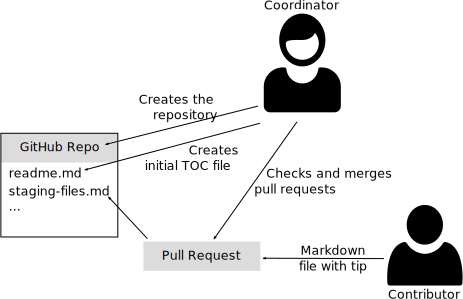

# Recap Day 1 - GitHub Tips

## Introduction

Your job as a team is to build a repository with tips about Git and GitHub. The content should be written in Markdown.



## Requirements

1. One team member (*coordinator*) connects her laptop to the video beamer so that handling the pull requests becomes a team effort

1. The *coordinator* creates the target repository. Only she has contributor permissions. Therefore, content contribution has to be done using Pull Requests.

1. Every team member except the *coordinator* has to think of a small tip that she wants to contribute (e.g. *how to get the URL of the GitHub repository for a local Git repository*) and tell it to the *coordinator*. The *coordinator* creates an issue for each topic.

1. The *coordinator* creates a *readme.md* file that acts as a table-of-content for the tips. At the beginning, it just contains a header and a paragraph with introduction text. At the end of the execercise, it has to contain a list of all tips with links to the corresponding Markdown files with the tips.

1. Every team member except the *coordinator* has to contribute a separate Markdown file with a short tip about GitHub using a pull request. Additionally, the link has to be added to *readme.md* (the team has to decide whether the link is included in the pull requests or added by the *coordinator*). Example:
    * Filename: *staging-files.md*
    * Content:
      ```md
      Pushing code to GitHub is a multi-stage process.
      The first step is to add changes to a local Git repository.
      This is done using the [*git add*](https://git-scm.com/docs/git-add) command.
      Example: `git add .` adds all changes of the local folder and subfolders.
      ```

1. The *coordinator* has to merge the pull requests into the repository.
